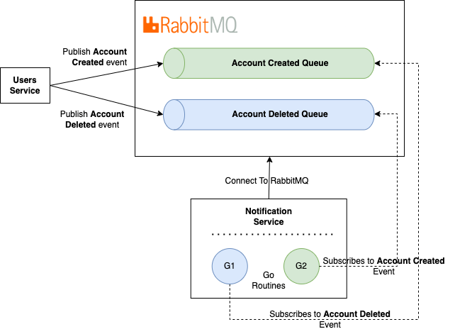

# Broker Client

Broker wraps Go AMQP 0.9.1 client (https://github.com/streadway/amqp) to expose an API in order to implement Event Driven Design pattern for Microservices Architecture.



# Install

```bash
go get github.com/mig-elgt/broker
```

# Publisher Example

```go
package main

import (
	"bytes"
	"log"
	"time"

	"github.com/mig-elgt/broker"
)

func main() {
	// Create Event Queue object
	eq, err := broker.NewEventQueue("localhost", "5672", "guest", "guest")
	if err != nil {
		panic(err)
	}
	defer eq.Close()
	// Open a new Channel
	ch, err := eq.OpenChannel()
	if err != nil {
		panic(err)
	}
	defer ch.Close()
	// Publish Events to RabbitMQ
	// 
	// Publish Event Account Created Event
	if err := eq.PublishEvent("account.created", "users.account.created", bytes.NewBufferString("hi folks"), ch); err != nil { 
		log.Fatal(err)
	}
	// Publish Event Account Deleted Event
	if err := eq.PublishEvent("account.deleted", "users.account.deleted", bytes.NewBufferString("good bye"), ch); err != nil { 
		log.Fatal(err)
	}
}

```

# Subscribers Example
Register your event handlers and create your function handler to perform a queue message.

```go
package main

import (
	"encoding/json"
	"log"

	"github.com/mig-elgt/broker"
)

func main() {
	// Create Event Queue instance
	eq, err := broker.NewEventQueue("localhost", "5672", "guest", "guest")
	if err != nil {
		panic(err)
	}
	defer eq.Close()

	// Register Handle Events
	// Add Account Created handle event
	eq.HandleEvent("account.created", func(req *broker.Request) (*broker.Response, error) {
	    // Add your code here
		return &broker.Response{}, nil
	}, broker.WithQueue("accounts_created"), broker.WithRouteKey("users.account.created"))
	// Add Account Deleted handle event
	eq.HandleEvent("account.deleted", func(req *broker.Request) (*broker.Response, error) {
	    // Add your code here
		return &broker.Response{}, nil
	}, broker.WithQueue("accounts_deleted"), broker.WithRouteKey("users.account.deleted"))
	// Exec runners for each event
	<-eq.RunSubscribers()

	log.Fatalf("rabbitmq server connection is closed %v", err)
}

```

# Run a Subcriber Example

```go
package main

import (
	"encoding/json"
	"log"

	"github.com/mig-elgt/broker"
)

func main() {
	// Create Event Queue instance
	eq, err := broker.NewEventQueue("localhost", "5672", "guest", "guest")
	if err != nil {
		panic(err)
	}
	defer eq.Close()

	// Register a Handle Event and run a Subscriber
	eq.RunSubscriber("account.created", func(req *broker.Request) (*broker.Response, error) {
	    // Add your code here
		return &broker.Response{}, nil
	}, broker.WithQueue("accounts_created"), broker.WithRouteKey("users.account.created"))

	log.Fatalf("rabbitmq server connection is closed %v", err)
}

```
